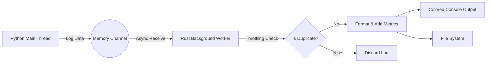

# 🦀 PyLogRust

**High-Performance, Asynchronous Python Logging Powered by Rust.**

`PyLogRust` is a Python extension that offloads logging operations to a background Rust thread. It ensures your Python application remains lightning-fast even when logging heavy traceback data or writing to slow disk I/O.


## ⚡ Why PyLogRust? (The Problems We Solve)

Standard Python logging libraries are excellent, but they often face performance bottlenecks in high-throughput or production environments. **PyLogRust** addresses these specific pain points:

### 1. The "Blocking I/O" Problem

* **Problem:** In standard Python, writing logs to a file or console can block the main execution thread. If the disk is slow, your API response time suffers.
* **Solution:** **Asynchronous Rust Core.** The Python side simply pushes data into a lock-free memory channel (microseconds). A separate Rust thread handles the heavy lifting (formatting, I/O) in the background. **Your Python code never waits for the disk.**

### 2. The "Error Storm" Problem

* **Problem:** When a database goes down or a bug appears in a loop, your logs are flooded with thousands of identical error messages, filling up disk space and making debugging impossible.
* **Solution:** **Smart Throttling.** PyLogRust automatically detects duplicate errors within a time window (e.g., 2 seconds) and drops them. You get the first error immediately, but avoid the spam.

### 3. The "Missing Context" Problem

* **Problem:** An error log tells you *what* happened, but often not *why* the server was slow or *which* user triggered it.
* **Solution:** **System Snapshots & Trace Context.** Every error log automatically includes:
* **Hardware Health:** Real-time CPU and Memory usage snapshots at the moment of the crash.
* **Trace ID:** Request tracking across nested functions.


---

## ✨ Features

* **🚀 Zero-Overhead Logging:** Python function execution is not blocked by logging I/O.
* **🛡️ `@debug` Decorator:** Zero-config error catching. Just add the decorator to any function.
* **🚦 Smart Throttling:** Define a `throttle_sec` interval to deduplicate identical errors.
* **📊 System Metrics:** Auto-injects CPU load and RAM usage into every error log.
* **🆔 Request Tracing:** Built-in context manager to track logs via Request IDs.
* **🎨 Colored Output:** Beautiful, high-visibility logs in the terminal.
* **📂 Automatic File Logging:** Stream logs to files with high-performance Rust file handling.
* **💥 Crash Control:** Choose whether to swallow errors (`crash=False`) or let them propagate (`crash=True`) via arguments.

---

## 🛠️ Installation

Since this is a mixed Python/Rust project, you need `maturin` to build it.

1. **Prerequisites:** Install Rust (cargo) and Python.
2. **Install Maturin:**
```bash
pip install maturin

```


3. **Build and Install:**
Navigate to the project directory and run:
```bash
maturin develop

```


*(This compiles the Rust core and installs it into your current Python environment)*

---

## 📖 Usage Guide

### 1. Initialization

You must initialize the Rust core before using the logger. This sets up the background thread.

```python
import pylogrust  # Assuming your package is named pylogrust

# Initialize the logger
# log_name: Name of your service
# file_path: Where to save logs (set None to disable file output)
# throttle_sec: Time in seconds to ignore duplicate errors (Anti-spam)
pylogrust.init_logger(
    log_name="PaymentService", 
    file_path="app_errors.log", 
    throttle_sec=2
)

```

### 2. The `@debug` Decorator

The easiest way to use PyLogRust is via the decorator. It automatically captures arguments, return values (if needed), and full tracebacks upon error.

```python
from pylogrust import debug

# Mode 1: Safe Mode (Default)
# Logs the error but keeps the program running (returns None)
@debug(crash=False)
def calculate_metrics(data):
    return 10 / data  # If data is 0, it logs but doesn't crash app

# Mode 2: Strict Mode
# Logs the error immediately via Rust, then re-raises the exception
@debug(crash=True)
def critical_process():
    raise ValueError("Database disconnected!")

```

### 3. Using Trace Context (Request IDs)

Track a specific request through multiple function calls.

```python
from pylogrust import set_request_id, debug

def handle_web_request():
    # Generates a unique 8-char ID for this context
    token = set_request_id() 
    
    process_user_data()
    save_to_db()

@debug
def process_user_data():
    # If this fails, the log will contain the ID generated above
    # helping you correlate it to the specific web request.
    pass

```

---

## 🏗️ Architecture



1. **Python Layer:** Collects function name, error message, traceback, and context vars.
2. **FFI Bridge (PyO3):** Passes data to Rust without copying large memory blocks where possible.
3. **Crossbeam Channel:** A high-performance, multi-producer single-consumer channel buffers the logs.
4. **Rust Worker:** A dedicated thread pulls logs, checks throttling rules, fetches system metrics (sysinfo), and writes to outputs.

---

## ⚙️ Configuration Options

| Parameter | Type | Description |
| --- | --- | --- |
| `log_name` | `str` | The name of your application/service (e.g., "AuthAPI"). |
| `file_path` | `str` (Optional) | Path to the output log file. If `None`, only prints to console. |
| `throttle_sec` | `int` | Deduplication window. If the same function fails multiple times within X seconds, subsequent logs are suppressed. Set `0` to disable. |

---

## 📄 License

MIT License
